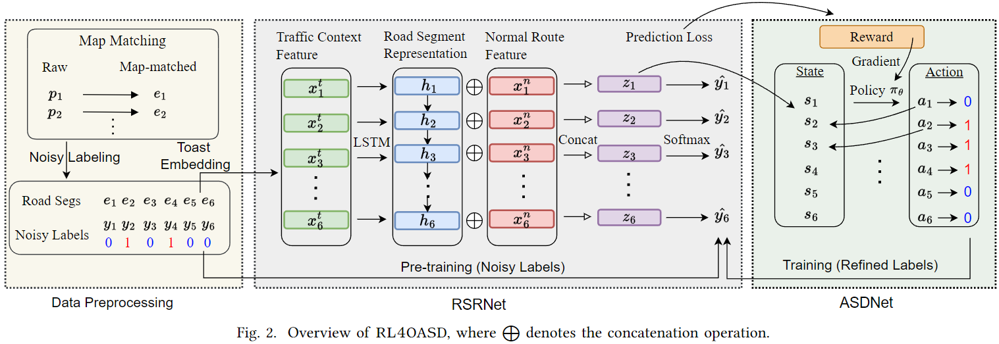
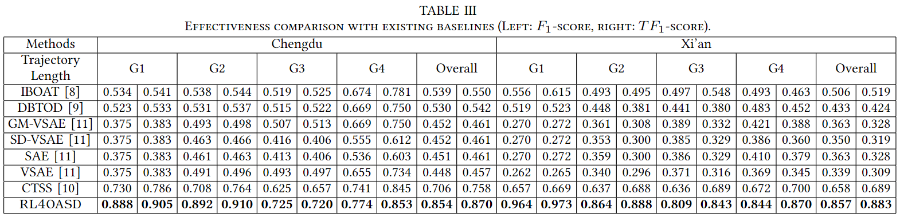

# OASD

This is the implementation of our paper "Online Anomalous Subtrajectory Detection on Road Networks with Deep Reinforcement Learning" (ICDE23).

## Requirements

* Linux Ubuntu OS (16.04 is tested)
* Python >= 3.5 (Anaconda3 is recommended and 3.6 is tested)
* Tensorflow (1.8.0 is tested)

Please refer to the source code to install the required packages that have not been installed in your environment such as gensim, networkx. You can install these packages in a shell as

```
pip install gensim
```

## Dataset & Preprocessing

The datasets are from DiDi Chuxing. We provide the data preprocessing in [`data_utils.py`](./data_utils.py), it outputs the processed data for our model training and testing. For ease of use, we dump these outputs as [data.zip](https://connecthkuhk-my.sharepoint.com/:u:/g/personal/zwang125_connect_hku_hk/EeTUfBORYA9FoMjmkmqi4xoBFkISEMDd7UCKwtO-9o9Fag?e=XgvvBC), which can be downloaded and unzipped into the ./OASD folder directly, or you may want to generate them step-by-step, just release the comments accordingly in the codes.

```
python data_utils.py
```

## Running Procedures

### Parameters

There are several parameters in [`parameter.py`](./parameter.py), you may try to turn these parameters for a better result, 
including `threshold=0.5` (for noisy labels), `consider=0.4` (for normal route selection), and `delay=8` (for delaying mechanism). In addition, it also includes other hyperparameters that are used in the model.

### Training

Run [`train.py`](./train.py), the generated models (RSRNet and ASDNet) will be automatically stored in the folder `./data/train_rsr` and `./data/train_asd`, respectively. 
You can pick the model with the best performance on the development set as your trained model from them.
You can set several parameters such as `epochs` during the training, please refer to the explanation in [`parameter.py`](./parameter.py) for more details.

```
python train.py
```
Here, we provide an interface called [`load(checkpoint)`](./train.py), and you can load an intermediate model to continue the training from the checkpoint, 
which saves your efforts caused by some unexpected exceptions and no need to train again.

### Evaluation

You can directly run the [`evaluation.py`](./evaluation.py) once you obtain the trained model. Here, we provide the trained model in the data.zip.

```
python evaluation.py
```



## Citing OASD ##
If our paper benefits to your research, please cite our paper using the bitex below:

    @article{zhang2022online,
    title={Online Anomalous Subtrajectory Detection on Road Networks with Deep Reinforcement Learning},
    author={Zhang, Qianru and Wang, Zheng and Long, Cheng and Huang, Chao and Yiu, Siu-Ming and Liu, Yiding and Cong, Gao and Shi, Jieming},
    journal={Proceedings of the 39th IEEE International Conference on Data Engineering},
    year={2022}
    }
